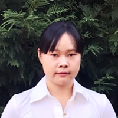

<!--  -->

## Welcome to YangLab Website

We are located on the third floor of Whitehead Biomedical Research Building at Emory University, and affiliated with the Center for Computational and Quantitative Genetics, Department of Human Genetics, Emory University School of Medicine 

PI: [Jingjing Yang](http://genetics.emory.edu/faculty/primary/yang-jingjing.html), PhD  
Assistant Professor  
Email: jingjing.yang@emory.edu  
[Center for Computational and Quantitative Genetics](http://ccqg.emory.edu/about/index.html)  
[Department of Human Genetics](http://genetics.emory.edu/)  
[Emory University School of Medicine](https://med.emory.edu/index.html)

[Google Scholar](https://scholar.google.com/citations?user=ANXPW-UAAAAJ&hl=en) 

### Research
The Yang Lab are interested in developing methods and tools to integrate multi-omics (genetic, transcriptomic, epigenetic, proteomic, and metabolomic) data for studying complex human diseases, such as Alzheimer's Disease. We use Bayesian statistical methods and machine learning methods with efficient computational algorithms. We are also interested in applied next-generation sequencing analysis with Whole Genomce Sequencing, RNA Sequencing, and ChIP Sequencing data. Programing languages we use include R, Python, C++, Perl, etc.

### PI - Background

I obtained my PhD in Statistics (2014) in the Statistics Department at Rice University, Houston, TX. My PhD work was about developing nonparametric Bayesian model for functional data analysis. After my graduation, I started working on Statistical Genetics as a Postdoctoral Fellow (2014-2017) in the group of
Goncalo Abecasis in the Biostatistics Department at the University of Michigan, Ann Arbor. Since my postdoc training, I have been very interested in utilizing statistical tools and computational efficient algorithms for genomics data analysis.

