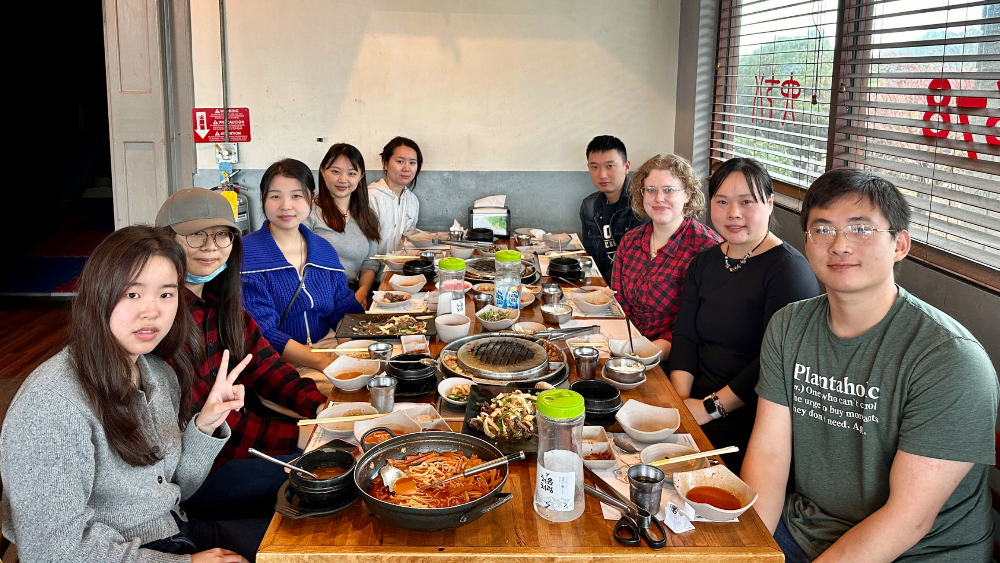
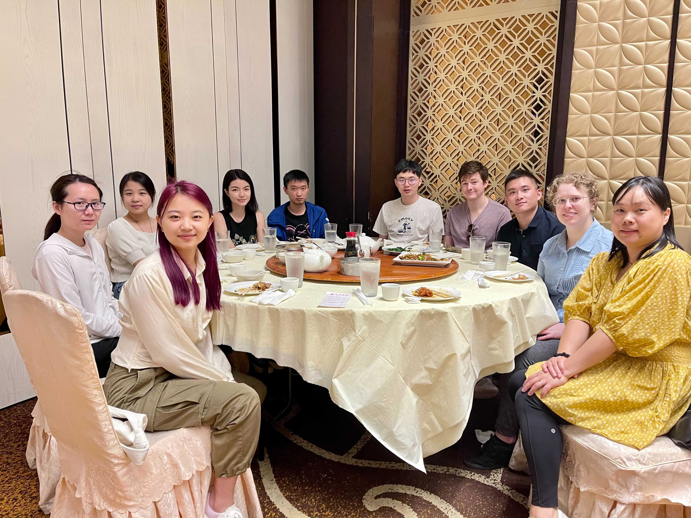
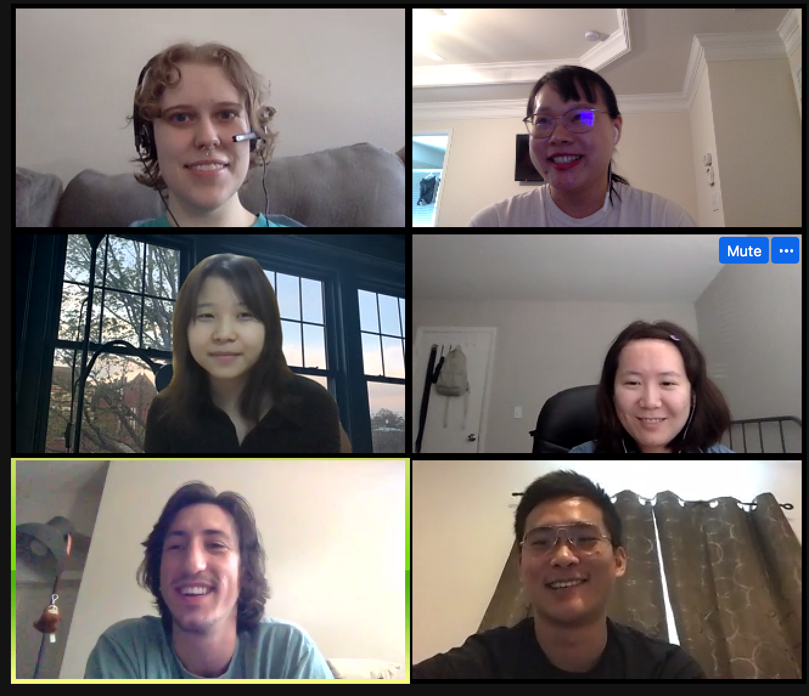
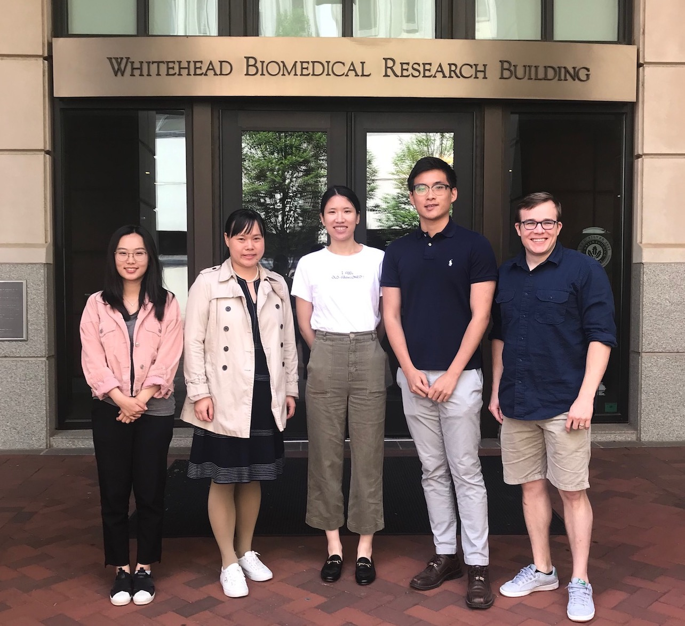

### Current Lab Members

| Name |  | Research topic |  | Year in Lab |
| ------ |--| ---------- |--| ----- |
| | | | | |
| Qile Dai   Biostat PhD Student  |  | Supervised Tensor Decomposition tool for studying Cell-cell Communication. |  |  2020 - Present| 
| | | | |  |
| Shizhen Tang   Biostat PhD Student  |  | Quantile regression based test for    differential gene expression analysis. | |   2021 - Present| 
| | | | | |
| Randy Parrish   Biostat PhD Student  |  | Applying Bayesian genome-wide method to PWAS. |  |  2022 - Present| 
| | | | | |
| Yingte Liu   Biostat MS Student  |  | Using machine learning methods to impute longitudinal AD pathologies. |  |  2023 - Present| 

### <a href="../assets/ComputationSlides/YangLabGuideline_2022.html">*Lab Onboarding Guidelines 2022*</a>

### Lab Alumni

* Rebecca Yu (High School Intern, 2021-2023), develop TIGAR Web Tool on AWS. Currently college student at Columnbia University.

* Shuyi Guo (Biosat Master Student, 2022-2023), Apply BGW-TWAS to study AD dementia and extend BGW-TWAS to using only summary eQTL data. Currently PhD student at UTHealth Houston School of Public Health.

* Tingyang Hu (Biosat Master Student, 2021-2023), PWAS of AD dementia. Currently PhD student at Pennsylvania State University College of Medicine.

* Lei Wang (Biosat Master Student, 2021-2022), Develop BFGWAS for using summary GWAS data. Currently PhD student at  University of Colorado Anschutz Medical Campus. 

* Kevin Johnson (Epidemiology Master Student, 2021-2022), Develop webtool for clinical sequence data analysis. Currently work at CDC.

* Emilia (Xizhu) Liu (QTM Undergraduate Student, 2021-2022), Impute brain pathology using clinical data. Currently Master student at Yale University School of Public Health. 

* Junyu Chen (Research Specialist, 2018-2020), Derive functional Bayesian GWAS with multiple quantitative annotations. Currently PhD student at Emory.

* Justin Luningham (Postdoc, 2018-2020), Novel Bayesian TWAS method by leveraging both cis- and trans- eQTL information. Currently Assistant Professor at University of North Texas Health Science Center. 

* Tianhui Mao (QTM Undergraduate Student, 2018-2019), Derive a risk prediction model for Alzheimer's disease. Currently data scientist. 

* Xiaoran Meng (Master Student, 2018-2019), GTEx data analysis and tool development of [TIGAR](https://github.com/yanglab-emory/TIGAR). Currently data scientist.

* Sini Nagpal, MS (Summer Intern, 2018). Nonparametric Bayesian method for TWAS. Currently PostDoc at Georgia Tech.

### Lab Photos

* December, 2022 (End-of-Semester Group Lunch)

* May, 2022 (End-of-Semester Group Lunch) 

* July, 2021 (All working remotely through this summer.)

* August, 2020 (All working remotely during this pandemic year.)

* May, 2019

