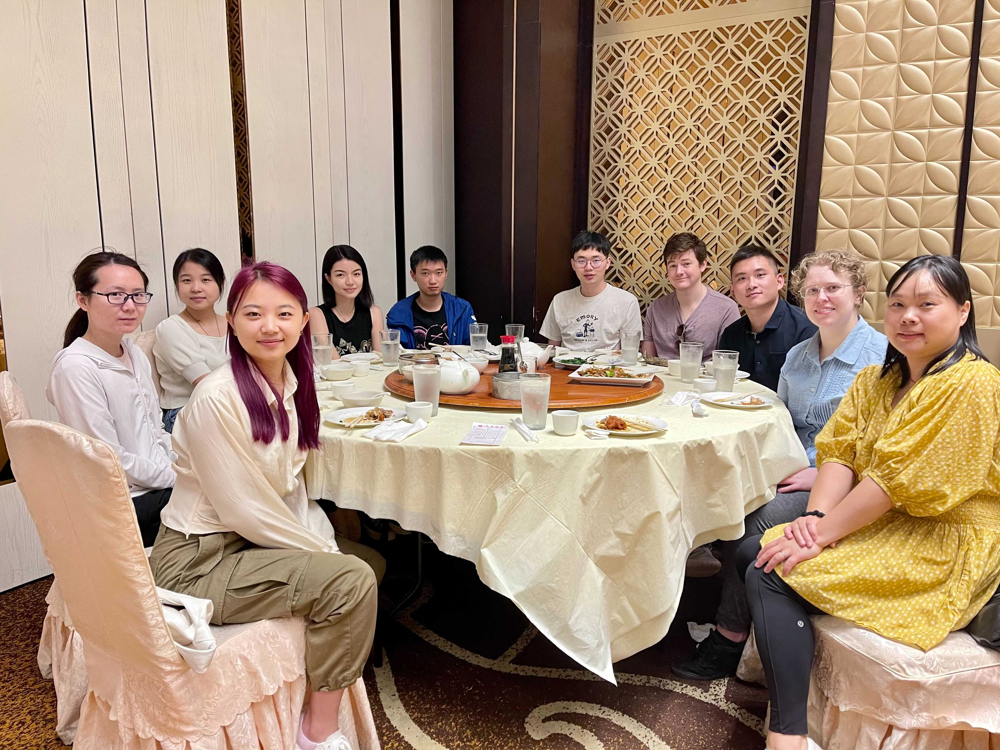
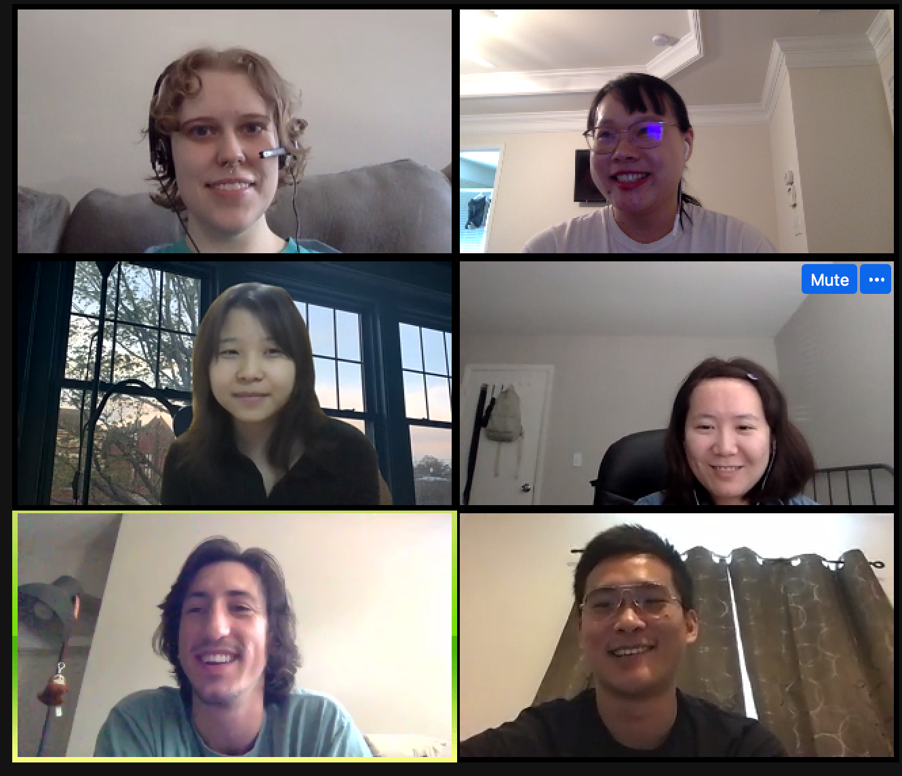
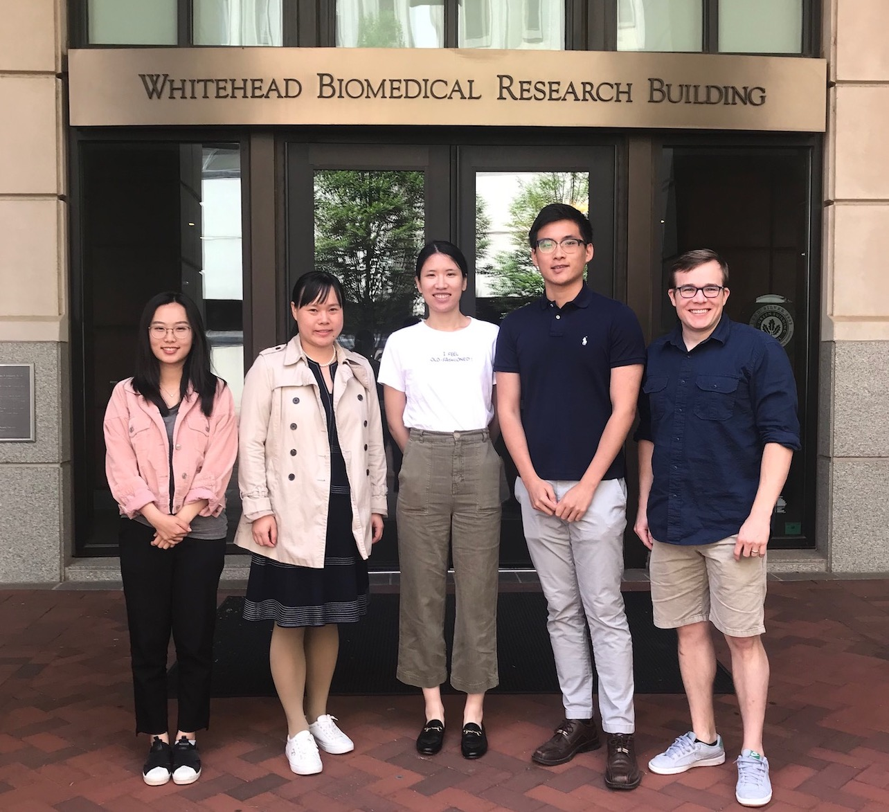

### Current Lab Members

| Name |  | Research topic |  | Year in Lab |
| ------ |--| ---------- |--| ----- |
| | | | | |
| Qile Dai   Biostat PhD Student  |  | Bayesian TWAS method using only   summary-level eQTL and GWAS data |  |  2020 - Present| 
| | | | |  |
| Shizhen Tang   Biostat PhD Student  |  | Quantile regression based test for    differential gene expression analysis. | |   2021 - Present| 
| | | | | |
| Randy Parrish   Biostat PhD Student  |  | Derive [TIGAR-V2](https://github.com/yanglab-emory/TIGAR) and   stacked regression TWAS. |  |  2022 - Present| 
| | | | |  |
| Tingyang Hu   Research Specialist  |  | Derive Bayesian DPR model based   method for PWAS. |  |  2022 - Present| 
| | | | |  |
| Shuyi Guo   Biostat Master Student  |  | Apply BGW-TWAS to GTEx V8. |  |  2022 - Present| 
| | | | |  |
| Rebecca Yu   High School Intern  |  | Develop TIGAR Web Tool. |  |  2021 - Present| 

### <a href="../assets/ComputationSlides/YangLabGuideline_2021.html">*Lab Onboarding Guidelines*</a>

### Lab Alumni

* Lei Wang (Biosat Master Student, 2021-2022), Develop BFGWAS for using summary GWAS data. Currently PhD student at  University of Colorado Anschutz Medical Campus. 

* Kevin Johnson (Epidemiology Master Student, 2021-2022), Develop webtool for clinical sequence data analysis.

* Emilia (Xizhu) Liu (QTM Undergraduate Student, 2021-2022), Impute brain pathology using clinical data. Currently Master student at Yale University School of Public Health. 

* Junyu Chen (Research Specialist, 2018-2020), Derive functional Bayesian GWAS with multiple quantitative annotations. Currently PhD student at Emory.

* Justin Luningham (Postdoc, 2018-2020), Novel Bayesian TWAS method by leveraging both cis- and trans- eQTL information. Currently Assistant Professor at University of North Texas Health Science Center. 

* Tianhui Mao (QTM Undergraduate Student, 2018-2019), Derive a risk prediction model for Alzheimer's disease. Currently data scientist. 

* Xiaoran Meng (Master Student, 2018-2019), GTEx data analysis and tool development of [TIGAR](https://github.com/yanglab-emory/TIGAR). Currently data scientist.

* Sini Nagpal, MS (Summer Intern, 2018). Nonparametric Bayesian method for TWAS. Currently PostDoc at Georgia Tech.

### Lab Photos

* May, 2022 (End-of-Semester Group Lunch) 

* July, 2021 (All working remotely through this summer.)

* August, 2020 (All working remotely during this pandemic year.)

* May, 2019

