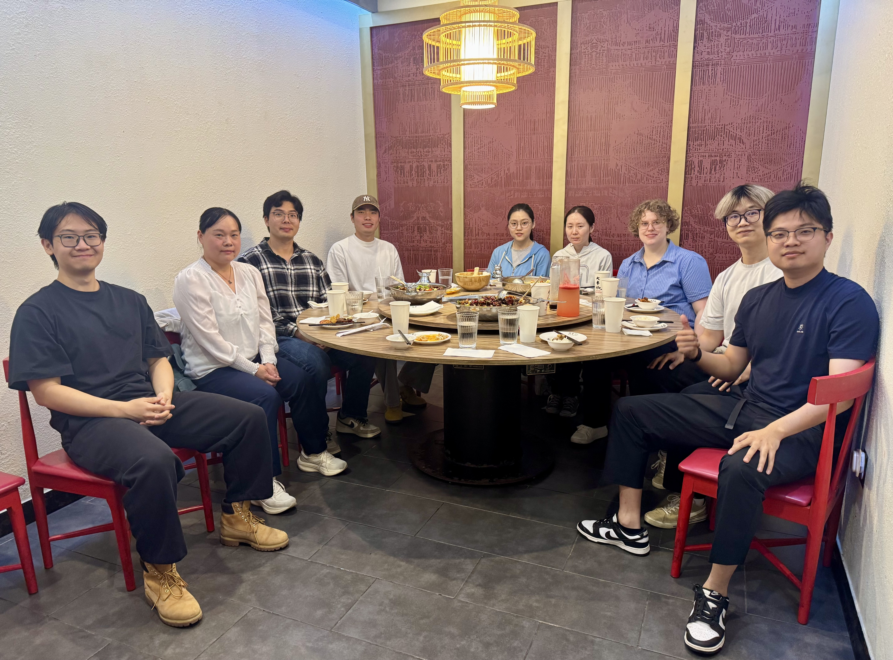

### Current Lab Members (updated June 2025)

| Name |Research Topics|Years in Lab|
|:------|:----------|:------|
| **Randy Parrish**   Biostat PhD Student  |Applying Bayesian genome-wide method to PWAS and develop TIGAR in R library. |2022-Present| 
| | | |
| **Leo Liu**   Biostat PhD Student  | Integrating multi-omics with GWAS summary stat.  |2025-Present| 
| | | |
| **Ruilong Chen**   Biostat PhD Student   | Studying omics data by tensor regression model.|2026-Present| 
| | | |
| **Peng Zhang**   Biostat MS Student   | TWAS of PD using reference transcriptomics data of multiple tissues.|2025-Present| 
| | | |
| **Lauren Ngo**   Biostat MS Student   | Predicting AD traits using deep learning model.|2025-Present| 
| | | |
| **Siyang Shen**   Research Specialist (Former Biostat MS Student)   | Predicting the risk of developing breast cancer using machine learning models and Bioinformatics analysis.|2025-Present| 
| | | |
| **Molly Murphy**   DDS Undergraduate Student  | Single cell eQTL studies.|2025-Present| 

### <a href="../assets/ComputationSlides/YangLabGuideline.html">*Lab Onboarding Guidelines*</a>

### Lab Alumni

* Arpit Ramani (Highschool Intern, 2024-2026), BGW-TWAS/PWAS study of AD dementia. College student at Georgia Institute of Techonology.

* Conglin Bao (Biostat MS Student, 2024-2026), Develop novel LSTM-RNN model for predicting AD pathology from longitudinal clinic data. PhD student at South Carolina University.

* Bo Shen (Biostat MS Student, 2024-2026), Develop novel TWAS method for correcting bias in using machine-learning imputed gene expressions. PhD student at Westlake University.

* Shizhen Tang (Biostat PhD Student, 2021-2026), Integrating spatial transcriptomics data with snRNAseq data for differntial gene expression analysis. Research Faculty at Department of Statistics, Radiation Effects Research Foundation, Hiroshima, Japan.

* Qile Dai (Biostat PhD Student, 2020-2025), TWAS using summary-level QTL data and Cell-cell Communication. Advisor Statistician at Eli Lilly.

* Coco Wu (QTM Undergraduate Student, 2024-2025), Sex-specific TWAS of PTSD. Master Student at Stanford.

* Siyang Shen (Biostat MS Student, 2024-2025), Predict breast cancer risk from benign biopsy transcriptomic data. Research Specialist at Emory.

* Yingte Liu (Biostat Master Student, 2023-2024), RNAseq data analysis and AD pathology imputation. Biostatistician at Grady Health System.

* Rebecca Yu (High School Intern, 2021-2023), develop TIGAR Web Tool on AWS. College student at Columbia University (Egleston Scholar).

* Shuyi Guo (Biostat Master Student, 2022-2023), Apply BGW-TWAS to study AD dementia and extend BGW-TWAS to using only summary eQTL data. PhD student at UTHealth Houston School of Public Health.

* Tingyang Hu (Biostat Master Student, 2021-2023), PWAS of AD dementia. PhD student at Pennsylvania State University College of Medicine.

* Lei Wang (Biostat Master Student, 2021-2022), Develop BFGWAS for using summary GWAS data. PhD student at  University of Colorado Anschutz Medical Campus. 

* Kevin Johnson (Epidemiology Master Student, 2021-2022), Develop webtool for clinical sequence data analysis. Epidemiologist at CDC.

* Emilia (Xizhu) Liu (QTM Undergraduate Student, 2021-2022), Impute brain pathology using clinical data. Master student at Yale University. Senior Computational Statistician at Eli Lilly. 

* Junyu Chen (Research Specialist, 2018-2020), Derive functional Bayesian GWAS with multiple quantitative annotations. PhD student at Emory.

* Justin Luningham (Postdoc, 2018-2020), Novel Bayesian TWAS method by leveraging both cis- and trans- eQTL information. Assistant Professor at Texas Christian University. 

* Tianhui Mao (QTM Undergraduate Student, 2018-2019), Derive a risk prediction model for Alzheimer's disease. Master student at MIT. Data scientist at McKinsey. 

* Xiaoran Meng (Master Student, 2018-2019), GTEx data analysis and tool development of [TIGAR](https://github.com/yanglab-emory/TIGAR). Data scientist in China.

* Sini Nagpal, MS (Summer Intern, 2018). Nonparametric Bayesian method for TWAS. PhD student at Georgia Tech. Assistant Professor at IIT Bombay, India.

### Lab Photos

* May, 2026 (End-of-Semester Group Lunch)

* May, 2025 (End-of-Semester Group Lunch)

* December, 2024 (End-of-Semester Group Lunch)

* December, 2022 (End-of-Semester Group Lunch)

* May, 2022 (End-of-Semester Group Lunch) 

* July, 2021 (All working remotely through this summer.)

* August, 2020 (All working remotely during this pandemic year.)

* May, 2019

