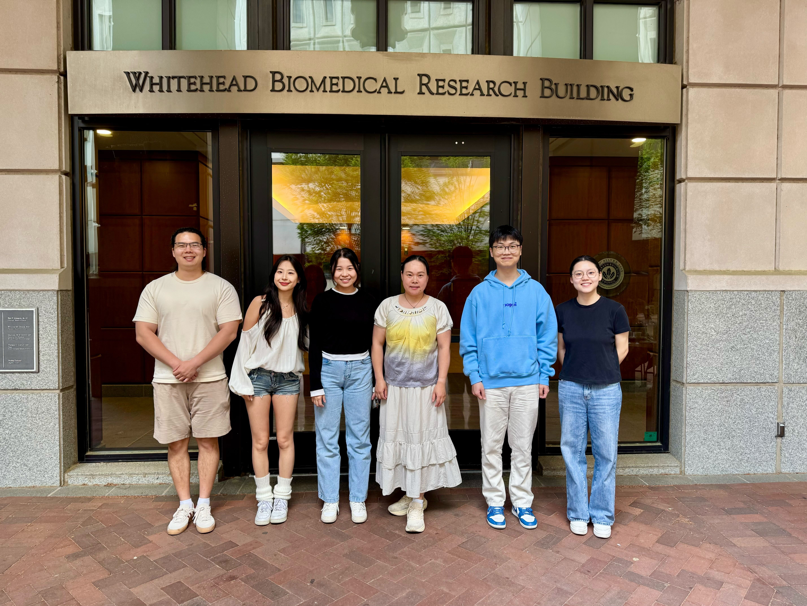
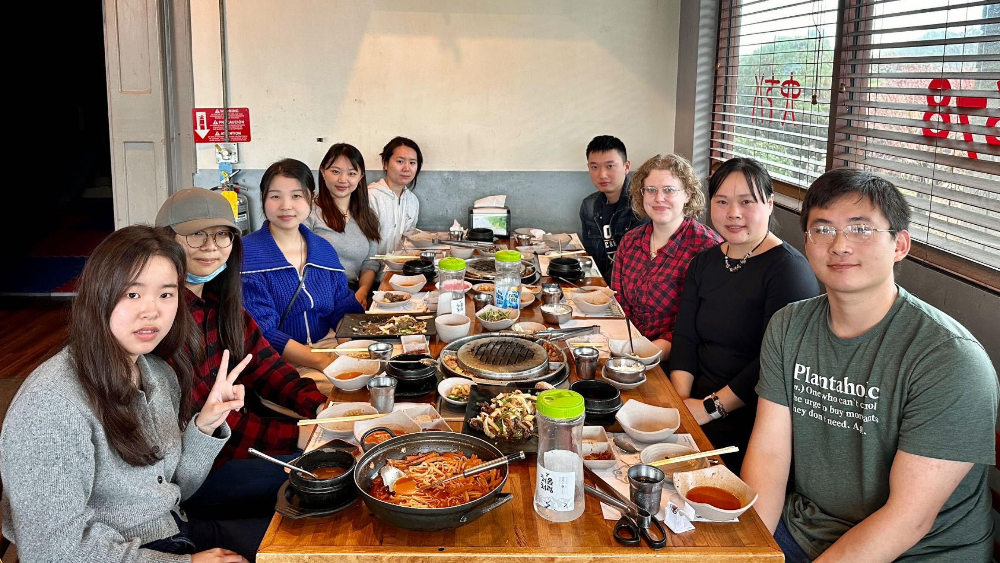
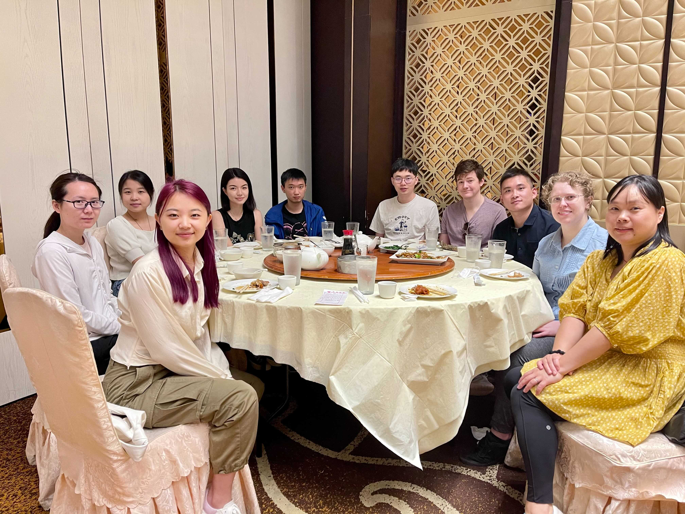
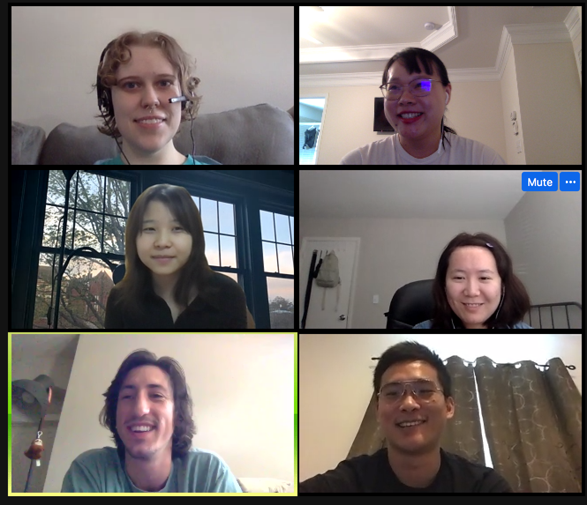
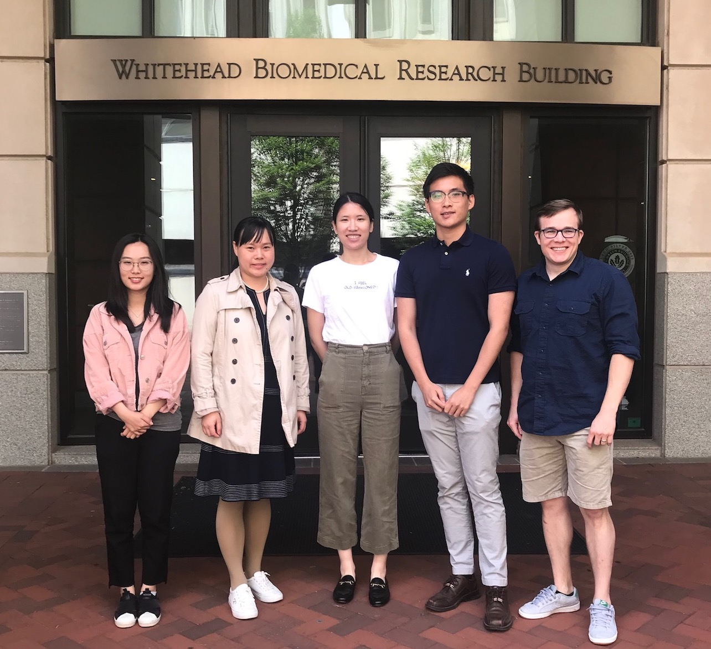

### Current Lab Members (updated June 2025)

| Name |Research Topics|Years in Lab|
|:------|:----------|:------|
| **Shizhen Tang**   Biostat PhD Student  |  Integrating spatial transcriptomics and snRNA-seq data. |2021-Present| 
| | | |
| **Randy Parrish**   Biostat PhD Student  |Applying Bayesian genome-wide method to PWAS. |2022-Present| 
| | | |
| **Leo Liu**   Biostat PhD Student  | Integrating multi-omics with GWAS summary stat.  |2025-Present| 
| | | |
| **Bo Shen**   Biostat MS Student  | TWAS method for correcting bias due to imputed gene expression. |2024-Present|
| | | | 
| **Conglin Bao**   Biostat MS Student  | Predicting AD pathologies using deep learning model. |2024-Present| 
| | | |
| **Ruilong Chen**   Biostat MS Student   | Studying omics data by tensor regression model.|2025-Present| 
| | | |
| **Arpit Ramani**   Wheeler High School Student | BGW-TWAS/PWAS study of AD dementia.|2024-Present| 

### <a href="../assets/ComputationSlides/YangLabGuideline.html">*Lab Onboarding Guidelines*</a>

### Lab Alumni

* Qile Dai (Biostat PhD Studen, 2020-2025), TWAS using summary-level QTL data and Cell-cell Communication. Currently Advisor Statistician at Eli Lilly.

* Coco Wu (QTM Undergradudate Student, 2024-2025), Sex-specific TWAS of PTSD. Currently Master Student at Stanford.

* Siyang Shen (Biostat MS Student, 2024-2025), Predict breast cancer risk from benign biopsy transcriptomic data. Currently Research Specialist at Emory.

* Yingte Liu (Biostat Master Student, 2023-2024), RNAseq data analysis and AD pathology imputation. Currently Biostatistician at Grady Health System.

* Rebecca Yu (High School Intern, 2021-2023), develop TIGAR Web Tool on AWS. Currently college student at Columnbia University.

* Shuyi Guo (Biosat Master Student, 2022-2023), Apply BGW-TWAS to study AD dementia and extend BGW-TWAS to using only summary eQTL data. Currently PhD student at UTHealth Houston School of Public Health.

* Tingyang Hu (Biosat Master Student, 2021-2023), PWAS of AD dementia. Currently PhD student at Pennsylvania State University College of Medicine.

* Lei Wang (Biosat Master Student, 2021-2022), Develop BFGWAS for using summary GWAS data. Currently PhD student at  University of Colorado Anschutz Medical Campus. 

* Kevin Johnson (Epidemiology Master Student, 2021-2022), Develop webtool for clinical sequence data analysis. Currently Epidemiologist at CDC.

* Emilia (Xizhu) Liu (QTM Undergraduate Student, 2021-2022), Impute brain pathology using clinical data. Currently Senior Computational Statistician at Eli Lilly. 

* Junyu Chen (Research Specialist, 2018-2020), Derive functional Bayesian GWAS with multiple quantitative annotations. Currently PhD student at Emory.

* Justin Luningham (Postdoc, 2018-2020), Novel Bayesian TWAS method by leveraging both cis- and trans- eQTL information. Currently Assistant Professor at University of North Texas Health Science Center. 

* Tianhui Mao (QTM Undergraduate Student, 2018-2019), Derive a risk prediction model for Alzheimer's disease. Currently data scientist at McKinsey. 

* Xiaoran Meng (Master Student, 2018-2019), GTEx data analysis and tool development of [TIGAR](https://github.com/yanglab-emory/TIGAR). Currently data scientist.

* Sini Nagpal, MS (Summer Intern, 2018). Nonparametric Bayesian method for TWAS. Currently PostDoc at Georgia Tech.

### Lab Photos

* May, 2025 (End-of-Semester Group Lunch)

* December, 2024 (End-of-Semester Group Lunch)

* December, 2022 (End-of-Semester Group Lunch)

* May, 2022 (End-of-Semester Group Lunch) 

* July, 2021 (All working remotely through this summer.)

* August, 2020 (All working remotely during this pandemic year.)

* May, 2019

